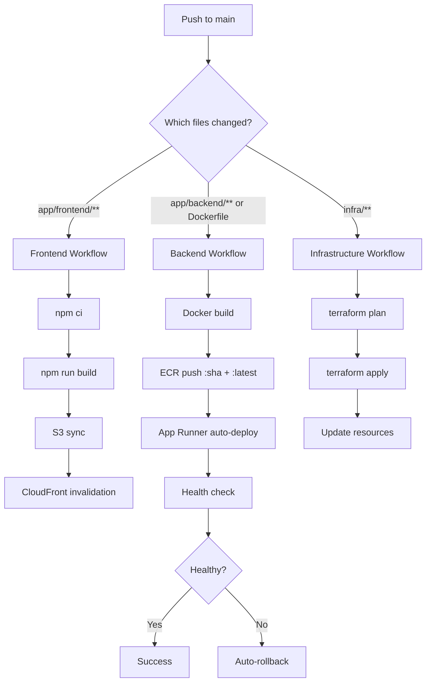

# 🚀 TradePulse.AI - Professional CI/CD Implementation Plan

## 📊 Current State Analysis

### ✅ What You Already Have

1. **Terraform Remote State** ✅
   - Backend: S3 (`tradepulse-terraform-state-590183672693`)
   - Locking: DynamoDB (terraform-locks)
   - Region: eu-west-2

2. **GitHub Actions** ✅
   - OIDC Authentication (no long-term AWS keys)
   - Docker build & push to ECR
   - Terraform deployment
   - Frontend build & deploy

3. **AWS Infrastructure** ✅
   - App Runner with auto-deploy enabled
   - ECR repository (tradepulse-backend)
   - S3 + CloudFront for frontend
   - DynamoDB tables
   - IAM roles & policies

### ⚠️ Current Issues

1. **Monolithic Workflow**
   - Single `ci-cd.yml` triggers on ALL changes
   - Wasteful: Frontend change rebuilds backend
   - Slow: 10-15 minute deployments for small fixes

2. **No Environment Separation**
   - Everything deploys to production
   - No staging/testing environment
   - Risky for incomplete features

3. **Inefficient Terraform Usage**
   - Runs on every push (even for code-only changes)
   - Should only run for infrastructure changes

---

## 🎯 Proposed CI/CD Architecture

### **Modular Workflows Strategy**

```
.github/workflows/
├── backend-deploy.yml      # Backend code changes only
├── frontend-deploy.yml     # Frontend code changes only
├── infra-deploy.yml        # Infrastructure changes only
└── ci-cd.yml (backup)      # Keep as reference
```

### **Deployment Flow**



---

## 📝 Implementation Files

### **1. Backend Deployment** (`backend-deploy.yml`)

**Triggers:**
- `app/backend/**`
- `Dockerfile`
- `app/backend/requirements.txt`

**Steps:**
1. Build Docker image
2. Tag with `:${GITHUB_SHA}` and `:latest`
3. Push both tags to ECR
4. App Runner auto-deploys `:latest`
5. Wait for deployment (max 10 min)
6. Health check with retries
7. Test critical endpoints

**Duration:** ~5-7 minutes

### **2. Frontend Deployment** (`frontend-deploy.yml`)

**Triggers:**
- `app/frontend/**`
- `!app/frontend/test/**`

**Steps:**
1. Install Node.js dependencies
2. Build Astro (production)
3. Sync to S3 (only changed files)
4. Invalidate CloudFront cache
5. Wait for invalidation complete
6. Smoke test frontend URL

**Duration:** ~2-3 minutes

### **3. Infrastructure Deployment** (`infra-deploy.yml`)

**Triggers:**
- `infra/**`
- `.github/workflows/infra-deploy.yml`

**Steps:**
1. Terraform fmt check
2. Terraform validate
3. Terraform plan (with output)
4. Wait for manual approval (optional)
5. Terraform apply
6. Output new resource URLs
7. Verify infrastructure health

**Duration:** ~3-5 minutes

---

## 🔄 Deployment Strategies

### **Backend Deployment**

```yaml
# App Runner automatically handles:
- Blue/Green deployment
- Health check monitoring
- Automatic rollback on failure
- Zero-downtime updates
```

**Current Configuration:**
```hcl
auto_deployments_enabled = true  # Already configured!
```

**How it works:**
1. GitHub Actions pushes `:latest` tag to ECR
2. App Runner detects new image
3. Starts new container
4. Runs health checks (`/health`)
5. If healthy: Routes traffic to new version
6. If unhealthy: Rolls back to previous version

### **Frontend Deployment**

```yaml
# CloudFront cache invalidation:
- Invalidate: /* (all files)
- Wait: up to 5 minutes
- Old version: Available during invalidation
- New version: Available after invalidation
```

### **Infrastructure Deployment**

```yaml
# Terraform state locking:
- Prevents concurrent changes
- S3 backend with DynamoDB lock
- Safe for team collaboration
```

---

## 🔐 Security Best Practices

### **OIDC Authentication** ✅ (Already Implemented)

```yaml
- No long-term AWS keys in GitHub Secrets
- Short-lived tokens via OIDC
- Least privilege IAM roles
- Automatic credential rotation
```

### **Secret Management** ✅ (Already Implemented)

```yaml
- Binance API keys: AWS SSM Parameter Store
- Database credentials: IAM roles
- Environment variables: Terraform managed
```

### **Container Security**

```yaml
# Recommended additions:
- Docker image scanning (Trivy)
- Vulnerability reporting
- Base image updates
- Non-root user (already implemented)
```

---

## 📊 Monitoring & Alerting

### **Deployment Monitoring**

**GitHub Actions:**
- Job status notifications
- Deployment duration tracking
- Failure alerts (optional: Slack/Discord)

**App Runner:**
- CloudWatch Logs
- Metrics: CPU, Memory, Requests
- Auto-scaling triggers

**Frontend:**
- CloudFront metrics
- S3 access logs
- Cache hit rate

### **Health Checks**

**Backend:**
```bash
GET /health
Expected: 200 OK
Response: {"status": "healthy", ...}
```

**Frontend:**
```bash
GET https://tradepulseai.co.uk/
Expected: 200 OK
Content-Type: text/html
```

**Trading Brain:**
```bash
GET /api/v1/trading/brain/status
Expected: {"brain_controller": {...}}
```

---

## 🚀 Rollback Strategies

### **Backend Rollback**

**Option 1: Automatic (App Runner)**
```bash
# Already configured - no action needed!
# App Runner automatically rolls back on health check failure
```

**Option 2: Manual (Emergency)**
```bash
# Deploy previous image tag
aws apprunner start-deployment \
  --service-arn <arn> \
  --source-configuration ImageRepository={
    ImageIdentifier=<ecr-uri>:<previous-sha>
  }
```

**Option 3: Terraform**
```bash
# Revert infra changes
git revert <commit>
terraform plan
terraform apply
```

### **Frontend Rollback**

**Option 1: S3 Versioning**
```bash
# Restore previous S3 version
aws s3api list-object-versions \
  --bucket tradepulse-frontend-...
  
aws s3api restore-object \
  --bucket <bucket> \
  --key <key> \
  --version-id <previous-version>
```

**Option 2: Git Revert + Redeploy**
```bash
git revert <commit>
git push origin main
# Triggers frontend-deploy.yml
```

---

## 📈 Performance Optimization

### **Build Caching**

```yaml
# Docker layer caching
- uses: actions/cache@v3
  with:
    path: /tmp/.buildx-cache
    key: ${{ runner.os }}-buildx-${{ github.sha }}
```

### **Dependency Caching**

```yaml
# Node.js dependencies
- uses: actions/cache@v3
  with:
    path: ~/.npm
    key: ${{ runner.os }}-node-${{ hashFiles('**/package-lock.json') }}
```

### **Terraform State**

```yaml
# Already optimized:
- S3 backend with versioning
- DynamoDB locking
- Remote execution
```

---

## 🧪 Testing Strategy

### **CI Pipeline Tests**

**Backend:**
```yaml
1. Linting (flake8, black)
2. Type checking (mypy)
3. Unit tests (pytest)
4. Integration tests (API endpoints)
5. Security scan (container vulnerabilities)
```

**Frontend:**
```yaml
1. Linting (ESLint)
2. Type checking (TypeScript)
3. Build verification
4. Lighthouse score (optional)
```

**Infrastructure:**
```yaml
1. terraform fmt -check
2. terraform validate
3. tfsec (security scanning)
4. terraform plan (dry-run)
```

### **Post-Deployment Verification**

```yaml
1. Health check (backend)
2. Smoke tests (frontend)
3. Critical endpoint tests
4. Trading Brain status
5. WebSocket connection test
```

---

## 📋 Migration Checklist

### **Pre-Migration**

- [ ] Backup current `ci-cd.yml`
- [ ] Review AWS credentials (OIDC role)
- [ ] Verify Terraform state accessibility
- [ ] Document current deployment process

### **Implementation**

- [ ] Create `backend-deploy.yml`
- [ ] Create `frontend-deploy.yml`
- [ ] Create `infra-deploy.yml`
- [ ] Test each workflow independently
- [ ] Update README with new workflow info

### **Testing**

- [ ] Test frontend-only deploy
- [ ] Test backend-only deploy
- [ ] Test infra-only deploy
- [ ] Verify App Runner auto-deploy
- [ ] Confirm rollback works

### **Production Cutover**

- [ ] Rename `ci-cd.yml` to `ci-cd.yml.backup`
- [ ] Monitor first production deploy
- [ ] Document any issues
- [ ] Update team documentation

### **Post-Migration**

- [ ] Clean up old workflow runs
- [ ] Archive backup workflow
- [ ] Update deployment runbook
- [ ] Train team on new workflows

---

## 🎓 DevOps Interview Talking Points

### **Infrastructure as Code**

> "We use Terraform for all AWS resources with remote state in S3 and DynamoDB locking. This ensures reproducibility and prevents concurrent modifications."

### **CI/CD Pipeline**

> "Our pipeline is modular - separate workflows for frontend, backend, and infrastructure. This reduces deployment time and minimizes risk of affecting unrelated components."

### **Security**

> "We use OIDC for AWS authentication, eliminating long-term credentials. Secrets are managed via AWS SSM Parameter Store and loaded at runtime, never committed to git."

### **Deployment Strategy**

> "App Runner provides blue/green deployments with automatic rollback. We tag images with both SHA (immutable) and 'latest' (for auto-deploy), giving us flexibility for different deployment scenarios."

### **Monitoring**

> "We monitor deployments via GitHub Actions, application health via CloudWatch, and frontend performance via CloudFront metrics. Health checks run post-deployment with automatic rollback on failure."

---

## 📚 Additional Resources

### **Documentation**
- [AWS App Runner Best Practices](https://docs.aws.amazon.com/apprunner/latest/dg/what-is-apprunner.html)
- [GitHub Actions OIDC](https://docs.github.com/en/actions/deployment/security-hardening-your-deployments/configuring-openid-connect-in-amazon-web-services)
- [Terraform AWS Provider](https://registry.terraform.io/providers/hashicorp/aws/latest/docs)

### **Tools**
- [terraform-docs](https://terraform-docs.io/) - Generate documentation
- [tfsec](https://aquasecurity.github.io/tfsec/) - Security scanning
- [Trivy](https://trivy.dev/) - Container vulnerability scanning

---

## ✅ Next Steps

1. **Review this plan** - Make sure it aligns with your goals
2. **Create new workflows** - I can implement them now
3. **Test in development** - Verify each workflow works
4. **Deploy to production** - Monitor first deployment
5. **Iterate and improve** - Add tests, monitoring, alerts

**Ready to implement? Let me know and I'll create all 3 workflow files!** 🚀
