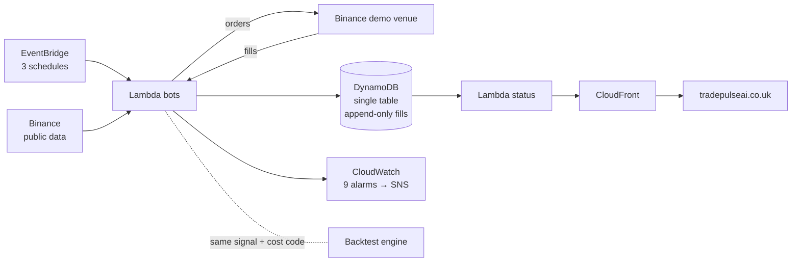

# TradePulse.AI

> An autonomous Bitcoin trading system that runs itself on AWS, sends its own
> orders to an exchange, and writes down what came back. Every proposed
> improvement is pre-registered, measured out-of-sample, and usually rejected.

**Live:** [tradepulseai.co.uk](https://tradepulseai.co.uk) — the public page,
reading the bots' real state · [bot.tradepulseai.co.uk](https://bot.tradepulseai.co.uk)
— the plain status endpoint.

**Status:** paper/demo only. No real capital has ever been at risk. The system
is serving a pre-registered evaluation window (M5) that opened **2026-07-16**;
gates are evaluated from **2026-09-10** and the live strategy is frozen until
then.

---

## What is actually running

Three bots on AWS Lambda, each answering a different question. Splitting them is
the point: when their numbers disagree, the difference is execution cost, and it
is measured rather than argued about.

| Bot | Schedule | Question it answers |
|---|---|---|
| `tradepulse-venue-4h` | every 4h | *Does it survive a real exchange?* Sends live orders to the Binance **demo** venue, keeps a durable fill log, runs a killswitch and position-risk limits. |
| `tradepulse-paper-bot` | daily 00:10 UTC | *Is the strategy right?* Pure simulation, touches no exchange. This is the channel M5 measures — **do not touch it**. |
| `tradepulse-shadow-bot` | daily 00:25 UTC | *Has the execution path rotted?* A token round-trip on the demo venue every day, so the plumbing is exercised even when the strategy is flat. |

Plus two read-only status endpoints (`-status` for the paper bot,
`tradepulse-site-status` for the public page).

The strategy itself is deliberately boring: **EMA 20 against EMA 100,
long-only**. Fast above slow means hold; fast below means stand aside.

## Architecture



**One rule above all: the signal and cost model are shared between backtest and
live** (`app/backend/backtesting/costs.py`, the strategy classes), so the live
bot cannot silently drift from what was validated. A `--fidelity` gate asserts
this against production on every check.

No servers, no containers, no scheduler to babysit. Everything is Terraform
across two independent roots.

## The public site

`web/` is a dependency-light static page (vanilla JS + TradingView
lightweight-charts, self-hosted fonts, no framework) on S3 + CloudFront. It
streams 4h candles from Binance, overlays the bot's own EMAs, and marks the bars
where orders were actually filled — read live from `/api/state`.

Deploy with `./scripts/deploy_site.sh` **from the repo root**.

## The validated edge — honest version

Walk-forward, out-of-sample, BTCUSDT, realistic costs:

| Config | Result |
|---|---|
| Naive long/short (EMA, RSI, regime) | ❌ loses to buy & hold in every regime |
| Short timeframes (15m) | ❌ destroyed by fees |
| Mean reversion, 1h | ❌ Sharpe −1.3 to −3.8, −100% return |
| **Long-only EMA trend-following (1d)** | ✅ **OOS Sharpe 1.00–1.14 vs buy & hold 0.81–1.00**, in every fold layout |

It improves *risk-adjusted* return and cuts drawdown. It does **not** beat buy &
hold on absolute return. Cost robustness is better than we first thought: at
0.5% per side Sharpe is still 0.96, because the strategy trades roughly twice a
year — the old note that "the edge dies above 0.3% fees" came from a
short-timeframe variant and was retired on 2026-07-28
(`docs/ANALIZA_KALIBRACJI_2026-07-28.md`).

A solid, honest foundation. Not a money printer.

## Execution: where theory meets the exchange

A backtest assumes a fill price; a venue gives you one. The system measures the
gap on every fill instead of trusting the assumption.

**First measured result: assumed slippage 2.0 bps, actual 4.4 bps — 2.2× the
assumption.** That is one observation; the execution gate (Gate C) needs twenty
before the number means anything, and it is collecting.

Supporting machinery, all in `app/backend/paper_trading/`:

- `execution.py` + `binance_demo.py` — order placement against the demo venue
- durable **append-only fill log** in DynamoDB: order id, requested vs filled
  quantity, assumed vs actual price, fee actually charged
- `killswitch.py` — tracks peak equity, halts on an unexplained drawdown
- `position_risk.py` — per-trade stop and daily loss limit, thresholds
  pre-registered from measurement rather than chosen to look good
- **idempotent order path** — the client order id is derived from the decision,
  not the moment of sending, so the exchange itself refuses a second copy; an
  unanswered submit is resolved by *asking* the venue rather than resending; and
  a run that finds one of its own fills missing from the book stops instead of
  deciding on a fiction
- `deadman.py` — a heartbeat to a service outside AWS, because every other alarm
  here lives in the account it is watching and cannot report that account's own
  disappearance

## What was tested and rejected

Nine upgrades, each with real literature behind it, each pre-registered and
each rejected out-of-sample. Keeping the list is cheaper than relearning it.

| Candidate | Why it died |
|---|---|
| Volatility targeting | Cuts drawdown as promised, but Sharpe falls at every target level in the 2022+ regime and turnover doubles |
| EMA speed ensemble | Passed the screen, failed the honest harness: 3 of 4 pre-specified checks rejected it |
| Regime filter ×3 | All three cut Sharpe; the one that improved drawdown cost ~0.05 Sharpe |
| Mean reversion ×4 | Sharpe 0.29–0.57 on daily vs ~1.0 for plain EMA; catastrophic on 1h |
| 4-hour timeframe | More bars, not more independent information — no faster proof |
| Short leg | Loses money net of costs |
| Maker-only orders | Worth nothing at this size and cadence |
| Meta-labeler | Zero discrimination (ρ = −0.01); 0 of 128 events actually attenuated — the "filter" was a flat 1.3× leverage in disguise |
| Trailing stop | The first candidate whose *premise* held — winners do peak ~40 pp above where they exit — and it fell anyway: the two horizons share one usable band value where three were required, and the apparent gain rests on a single trade |

Write-ups are in `docs/`. The strategy running today is the one from day one —
not stubbornness, just the only candidate that has not yet failed a test.

## On the ML "brain"

Earlier versions of this repo centred on a six-layer ML ensemble. A deep audit
on 2026-07-17 (`docs/ANALIZA_6_WARSTW_2026-07-17.md`) found circular labels,
leaky splits and unit bugs across those layers, and concluded: **retrain
nothing.** Those engines are now quarantined — the five condemned classes refuse
to start without `ENTERPRISE_ENGINES=on`, and nothing in the live path imports
them.

The one honest way ML returns is a single meta-labeler over the EMA signal. That
was implemented exactly as pre-registered and **rejected on the evidence** (see
the table above). It stays rejected until there are roughly twice as many
labelled events, or genuinely new features.

## Repository layout

```
app/backend/
  paper_trading/    the live system: bots, venue execution, fill log,
                    killswitch, position risk, gates, status endpoints
  backtesting/      indicators, strategies, event-driven engine (next-bar-open,
                    fees + slippage), metrics, walk-forward
  core/quarantine.py  the guard that keeps the retired ML engines off
scripts/research/   pre-registered studies; every rejection above has one
docs/               the write-ups those studies produced
infra-serverless/   Terraform: bots, DynamoDB, alarms, DNS       (M5 — frozen)
infra-site/         Terraform: S3 + CloudFront + status API      (safe to change)
web/                the public site
```

Two directories are **legacy and not part of the live system**: `infra/`
(an older App Runner stack) and `app/frontend/` (an Astro app from the
pre-serverless era). They are kept for reference only.

`infra-site/` is a separate Terraform root **on purpose**: during the M5 window
an `apply` there physically cannot plan a change against the frozen bot Lambdas.

## Quickstart

```bash
# Historical data is not committed — regenerate what you need.
# Use bulk_download; download.py has a partial-bar trap. Then verify it.
python -m app.backend.backtesting.bulk_download --symbol BTCUSDT --interval 1d \
    --start 2017-08 --end 2026-07-16 --out data/ml/historical/BTCUSDT_1d.csv
python -m app.backend.backtesting.integrity 'data/ml/historical/*.csv' --strict

# Backtest, then prove it out-of-sample
python -m app.backend.backtesting.run --data data/ml/historical/BTCUSDT_1d.csv --timeframe 1d
python -m app.backend.backtesting.walkforward --data 'data/ml/historical/*.csv' --timeframe 1d

# Run the paper bot once (this is what the Lambda does on a schedule)
python -m app.backend.paper_trading.run step

# Check the live gates against production
python -m app.backend.paper_trading.gate --source dynamodb              # Gate B
python -m app.backend.paper_trading.gate --source dynamodb --fidelity   # Gate A: backtest == live
python -m app.backend.paper_trading.gate --source dynamodb --cost-fidelity  # Gate C: execution cost
```

## Tests

```bash
pytest app/backend/tests/test_backtesting.py \
       app/backend/tests/test_paper_trading.py -q
```

`test_paper_trading.py` contains the **equivalence test**: the paper book must
match the backtest engine to 1e-6. That is the proof that backtest = live. If it
fails, stop — it is the most important test in the repo.

Five GitHub Actions workflows run tests and secret scanning on every push.

## Cost

About **$1.35/month, all in**: $0.50 for the Route 53 hosted zone and $0.75 for
the domain. Lambda, CloudFront, CloudWatch and DynamoDB all round to $0.00 —
checked against the actual bill, not the price list. That number is the reason
the design looks the way it does.

## Security

Real credentials are never committed; the live keys live in SSM. See
[`SECURITY.md`](SECURITY.md) for the rotation checklist and current posture.
Historical data stays out of git (regenerate it); training code is tracked.
`gitleaks` runs in CI over the whole PR range.

## Roadmap

- [x] Backtesting framework + rule-based strategies
- [x] Walk-forward validation → found the trend-following edge
- [x] Paper bot with a verified backtest = live guarantee
- [x] Serverless deployment (Lambda + EventBridge + DynamoDB)
- [x] Execution layer on a demo venue: real fills, durable log, killswitch, position risk
- [x] Execution safety: idempotent orders, fail-closed reconciliation, conditional
      state writes, an alarm on the killswitch firing, a dead-man switch, and a
      runbook (`docs/RUNBOOK.md`)
- [x] Public site on `tradepulseai.co.uk`
- [ ] **M5 gates** — evaluated from 2026-09-10. Gate B has ~1% power over 8 weeks, so `INCONCLUSIVE_EXTEND` is the expected verdict; the real horizon is 12–18 months
- [ ] **Gate C** — 20 observed fills before execution quality can be judged
- [ ] Real money, small, only if the gates say so
