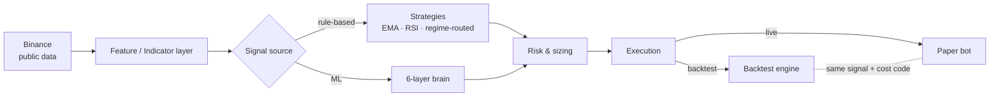

# TradePulse.AI

> AI-assisted Bitcoin day-trading system — live market data, a multi-layer ML
> "brain", **rule-based strategies validated by a rigorous backtester**, and a
> live **paper-trading bot** that shares the exact same signal and cost code as
> the backtest. Paper-first, built toward a real bot.

**Status:** paper trading (virtual portfolio). Real-order plumbing exists but is
gated off. Active work on branch `improvements/security-and-strategies`.

---

## Why this exists

The original system generated signals **only** from an ML ensemble and had no
way to measure whether anything actually worked. This repo adds the missing
foundation: a **backtesting layer** for ground truth, a **walk-forward** harness
to prove edge out-of-sample, and a **paper bot** that runs the validated
strategy live — with a hard guarantee that backtest and live cannot diverge.

## Architecture



**One rule above all: the signal and cost model are shared between backtest and
live** (`app/backend/backtesting/costs.py`, strategy classes), so the paper bot
can never silently drift from what was validated.

### The ML "brain" (runtime engine)

`brain_controller` (FSM) → `day_trading_engine` → `enterprise_trading_engine`
runs a 6-layer analysis:

| Layer | Role | Model |
|-------|------|-------|
| L1 | Market regime | `layer_1_regime.pkl` |
| L2 | Price ensemble | `lstm_{1m,5m,1h,4h,24h}.h5` |
| L3 | Reversal detection | `layer_3_reversal.pkl` (LightGBM) |
| L4 | Technical filters | `layer_4_filters.pkl` |
| L5 | Confidence scoring | `layer_5_confidence.pkl` |
| L6 | Adaptive timing | `layer_6_timing.pkl` |

Models live in `app/backend/models/enterprise/`. They are **trained** by the
scripts in `app/backend/scripts/ml/` (e.g. `6layer_enterprise_trainer.py`).

### Rule-based strategies + backtesting (`app/backend/backtesting/`)

A self-contained, dependency-light framework (no TF/DynamoDB): indicators →
strategies → **event-driven engine** (next-bar-open execution = no look-ahead,
fees + slippage, intrabar SL/TP) → metrics → **walk-forward** optimisation.

### Paper bot (`app/backend/paper_trading/`)

Fetches live Binance bars, computes the target position with the same strategy
code, reconciles a virtual portfolio with the same cost model, and persists
state. Idempotent per bar (cron-safe).

## The validated edge (honest)

Walk-forward, out-of-sample, BTCUSDT, realistic costs:

| Config | Result |
|--------|--------|
| Naive long/short (EMA, RSI, regime) | ❌ lose to buy&hold in every regime |
| Short timeframes (15m) | ❌ destroyed by fees (+146% fee drag) |
| **Long-only EMA trend-following (1d)** | ✅ **Sharpe 1.27 vs 1.12 buy&hold, drawdown −50% vs −77%** |

It **reduces drawdown** and beats buy&hold risk-adjusted — it does not beat
buy&hold on absolute return, and its edge dies above ~0.3% fees. A solid, honest
foundation, not a money printer.

## Quickstart

```bash
# 1. Historical data is not committed — regenerate what you need
python -m app.backend.backtesting.download --interval 1d --start 2020-01-01 \
    --out data/ml/historical/BTCUSDT_1d.csv

# 2. Backtest strategies
python -m app.backend.backtesting.run --data data/ml/historical/BTCUSDT_1d.csv --timeframe 1d

# 3. Walk-forward validation (out-of-sample)
python -m app.backend.backtesting.walkforward --data 'data/ml/historical/*.csv' --timeframe 1d

# 4. Run the paper bot once (cron this daily)
python -m app.backend.paper_trading.run step

# 5. Full local stack (backend + frontend + DynamoDB Local)
./start_local.sh
```

## Project structure

```
app/
  backend/
    brain/            FSM orchestrator (brain_controller, state, events)
    services/         trading engines, risk, market data, learning
    models/enterprise ML models (.pkl / .h5) — committed
    scripts/ml/       model TRAINING pipeline
    backtesting/      indicators, strategies, engine, walk-forward  ← new
    paper_trading/    live paper bot (backtest = live)              ← new
    tests/            pytest suites
  frontend/           Astro 5 + Preact + Tailwind
infra/                Terraform (AWS App Runner + DynamoDB + ECR)
scripts/              ops scripts (paper bot runner, folder compare, teardown)
```

## Tech stack

**Backend** Python 3.11, FastAPI, TensorFlow (LSTM), LightGBM/XGBoost,
scikit-learn, pandas/numpy, boto3 (DynamoDB).
**Frontend** Astro 5, Preact, TypeScript (strict), TailwindCSS, lightweight-charts.
**Infra** AWS App Runner + DynamoDB + ECR + CloudWatch, GitHub Actions CI.
**Data** Binance public WebSocket + REST (BTCUSDT).

## Roadmap

- [x] **Phase 0** Security — secrets out of git, auth backdoors closed, gitleaks in CI
- [x] **Phase 1** Backtesting framework + rule-based strategies
- [x] **Phase 1b** Walk-forward validation → found the trend-following edge
- [x] **Paper bot** with verified backtest = live guarantee
- [x] **Phase 2** Cleanup — data out of git, dead code, single source of truth
- [ ] **Serverless** deploy the paper bot (Lambda + EventBridge + DynamoDB, ~$0/mo)
- [ ] More edge (ML as a *filter* over strategies, more markets) then real money — slowly

## Security

Real credentials must never be committed. See [`SECURITY.md`](SECURITY.md) for
the key-rotation checklist and current posture. Historical/training **data** is
kept out of git (regenerate with `backtesting/download.py`); training **code**
is tracked.

## Tests

```bash
pytest app/backend/tests/test_backtesting.py app/backend/tests/test_paper_trading.py -q
```

CI runs these on every push (`.github/workflows/tests.yml`).
