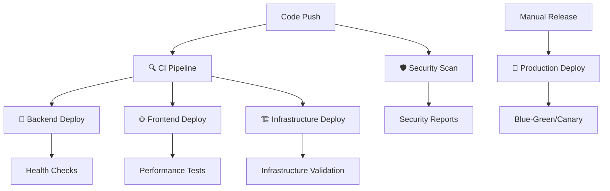

# 🚀 TradePulse.AI GitHub Actions Workflows

This directory contains the complete CI/CD pipeline for TradePulse.AI, designed for enterprise-grade deployment with comprehensive quality gates and security scanning.

## 📁 Workflow Overview

### Core Workflows

1. **🔍 `ci.yml`** - Continuous Integration
   - **Triggers**: Push, PR to main/develop
   - **Purpose**: Quality gates, testing, validation
   - **Duration**: ~8-12 minutes
   - **Components**:
     - Backend quality (Ruff, MyPy, Bandit, Safety)
     - Backend tests (pytest with DynamoDB Local)
     - Frontend quality (ESLint, Prettier, TypeScript)
     - Frontend tests (Jest, Playwright, E2E)
     - Infrastructure validation (Terraform fmt, validate, tfsec)

2. **🚀 `deploy-backend.yml`** - Backend Deployment
   - **Triggers**: CI completion, manual dispatch
   - **Purpose**: Deploy Python/FastAPI backend to AWS Lambda
   - **Duration**: ~5-8 minutes
   - **Features**:
     - Multi-environment support (dev/staging)
     - Proper Lambda packaging with dependencies
     - Health checks and smoke tests
     - Rollback on failure

3. **🌐 `deploy-frontend.yml`** - Frontend Deployment
   - **Triggers**: CI completion, manual dispatch
   - **Purpose**: Deploy Astro/Preact frontend to S3 + CloudFront
   - **Duration**: ~4-6 minutes
   - **Features**:
     - Optimized builds with environment-specific configs
     - S3 sync with proper cache headers
     - CloudFront invalidation with completion wait
     - Performance validation

4. **🏗️ `deploy-infra.yml`** - Infrastructure Deployment
   - **Triggers**: Push to infra/, manual dispatch
   - **Purpose**: Deploy/update AWS infrastructure via Terraform
   - **Duration**: ~10-15 minutes
   - **Features**:
     - Multi-environment support (dev/staging/prod)
     - Terraform plan/apply with validation
     - Cost estimation (Infracost)
     - Security scanning (tfsec, Checkov)
     - PR comments with plan details

5. **🚀 `deploy-production.yml`** - Production Deployment
   - **Triggers**: Manual dispatch only
   - **Purpose**: Production releases with advanced deployment strategies
   - **Duration**: ~15-25 minutes
   - **Features**:
     - Release tag validation
     - Blue-green deployment
     - Canary deployment with manual promotion
     - Rolling deployment
     - Comprehensive health checks
     - Performance validation

6. **🛡️ `security-scan.yml`** - Security Scanning
   - **Triggers**: Push, PR, daily schedule
   - **Purpose**: Comprehensive security analysis
   - **Duration**: ~15-20 minutes
   - **Components**:
     - Dependency scanning (Safety, Snyk, npm audit)
     - SAST (Bandit, Semgrep, ESLint Security)
     - Secrets detection (GitLeaks, TruffleHog)
     - Container scanning (Trivy, Grype)
     - Infrastructure security (Checkov, Terrascan, KICS)
     - API security testing (OWASP ZAP, Nuclei)

## 🔄 Workflow Dependencies



## 🎯 Environment Strategy

### Development Environment
- **Auto-deploy**: Every push to `main`
- **Purpose**: Development testing and validation
- **URL**: `https://dev.tradepulse.ai`
- **Database**: DynamoDB Local → AWS DynamoDB Dev

### Staging Environment  
- **Manual deploy**: Promoted from development
- **Purpose**: Pre-production testing
- **URL**: `https://staging.tradepulse.ai`
- **Database**: AWS DynamoDB Staging

### Production Environment
- **Manual deploy**: Tagged releases only
- **Purpose**: Live trading application
- **URL**: `https://app.tradepulse.ai`
- **Database**: AWS DynamoDB Production
- **Strategies**: Blue-green, Canary, Rolling

## 🔐 Required Secrets

### Repository Secrets
```yaml
# AWS Access
AWS_ROLE_ARN_DEV: arn:aws:iam::ACCOUNT:role/GitHubOIDCDeployRole-Dev
AWS_ROLE_ARN_STAGING: arn:aws:iam::ACCOUNT:role/GitHubOIDCDeployRole-Staging  
AWS_ROLE_ARN_PROD: arn:aws:iam::ACCOUNT:role/GitHubOIDCDeployRole-Prod

# S3 Buckets
S3_BUCKET_DEV: tradepulse-dev-site
S3_BUCKET_STAGING: tradepulse-staging-site
S3_BUCKET_PROD: tradepulse-prod-site

# CloudFront Distributions
CLOUDFRONT_ID_DEV: E1234567890ABC
CLOUDFRONT_ID_STAGING: E1234567890DEF
CLOUDFRONT_ID_PROD: E1234567890GHI

# Security Scanning
SNYK_TOKEN: snyk-token-here
SEMGREP_APP_TOKEN: semgrep-token-here
INFRACOST_API_KEY: ico-key-here
```

### Environment Secrets
```yaml
# Development Environment
development:
  DATABASE_URL: dynamodb://localhost:8000
  JWT_SECRET_KEY: dev-jwt-secret
  BINANCE_API_KEY: dev-binance-key
  BINANCE_SECRET_KEY: dev-binance-secret

# Staging Environment  
staging:
  DATABASE_URL: dynamodb://staging-endpoint
  JWT_SECRET_KEY: staging-jwt-secret
  BINANCE_API_KEY: staging-binance-key
  BINANCE_SECRET_KEY: staging-binance-secret

# Production Environment
production:
  DATABASE_URL: dynamodb://prod-endpoint
  JWT_SECRET_KEY: prod-jwt-secret
  BINANCE_API_KEY: prod-binance-key
  BINANCE_SECRET_KEY: prod-binance-secret
  MONITORING_API_KEY: prod-monitoring-key
```

## 🚦 Quality Gates

### Backend Quality Gates
- ✅ **Code Formatting**: Ruff compliance
- ✅ **Type Checking**: MyPy validation
- ✅ **Security**: Bandit + Safety scans
- ✅ **Test Coverage**: ≥90% pytest coverage
- ✅ **Integration Tests**: DynamoDB Local tests

### Frontend Quality Gates
- ✅ **Linting**: ESLint compliance
- ✅ **Formatting**: Prettier compliance  
- ✅ **Type Checking**: TypeScript validation
- ✅ **Unit Tests**: ≥85% Jest coverage
- ✅ **E2E Tests**: Playwright automation
- ✅ **Accessibility**: Zero violations
- ✅ **Performance**: Lighthouse ≥90 score

### Infrastructure Quality Gates
- ✅ **Formatting**: Terraform fmt
- ✅ **Validation**: Terraform validate
- ✅ **Security**: tfsec, Checkov, Terrascan
- ✅ **Cost Control**: Infracost estimation
- ✅ **Compliance**: AWS Config rules

## 📊 Monitoring & Observability

### Deployment Tracking
- **Artifacts**: Build packages, test reports, security scans
- **Retention**: 30-90 days based on type
- **Notifications**: Slack integration (TODO)
- **Metrics**: Deployment success rates, duration

### Security Monitoring
- **Daily Scans**: Automated security pipeline
- **SARIF Upload**: GitHub Security tab integration
- **Vulnerability Tracking**: Dependency updates
- **Compliance Reports**: SOC2, GDPR readiness

## 🔧 Customization

### Adding New Environments
1. Create new Terraform environment in `infra/terraform/envs/`
2. Add environment secrets to GitHub
3. Update workflow environment matrices
4. Configure DNS and SSL certificates

### Adding New Security Scans
1. Add scan step to `security-scan.yml`
2. Configure tool-specific secrets
3. Update SARIF upload step
4. Add results to security summary

### Performance Optimization
- **Parallel Jobs**: Most workflows run jobs in parallel
- **Caching**: npm, pip, Terraform provider caches
- **Artifact Reuse**: Build once, deploy multiple times
- **Conditional Execution**: Skip unnecessary steps

## 🚀 Getting Started

1. **Setup AWS OIDC**: Configure GitHub OIDC provider in AWS
2. **Create Secrets**: Add all required repository and environment secrets
3. **Bootstrap Infrastructure**: Run Terraform bootstrap once
4. **Test Pipeline**: Create PR to trigger CI pipeline
5. **Deploy Development**: Push to main to trigger dev deployment

## 📚 Best Practices

- **Never skip security scans** in production deployments
- **Always test in staging** before production releases
- **Use tagged releases** for production deployments only
- **Monitor deployment metrics** and set up alerts
- **Review security reports** regularly and address issues
- **Keep dependencies updated** using Dependabot
- **Document infrastructure changes** in PR descriptions
- **Use environment-specific configurations** properly

---

*This CI/CD pipeline is designed for enterprise-grade trading applications with strict security, compliance, and reliability requirements.*
